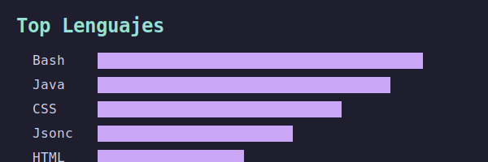

# <samp>Zhaleff</samp>

<p align="center">
  
</p>

---

<p align="center">
  <a href="https://github.com/zhaleff">
    
  </a>
  <a href="https://instagram.com/zhaleff">
    
  </a>
  <a href="https://open.spotify.com/playlist/your-playlist">
    
  </a>
  
</p>

---

<div align="center">

```
╭───────────────────────────────────────────────────────────╮
│  ▓▓▓▓▓▓▓▓▓▓▓▓▓▓▓▓▓▓▓▓▓▓▓▓▓▓▓▓▓▓▓▓▓▓▓▓▓▓▓▓▓▓▓▓▓▓▓▓▓▓▓▓▓  │
│  ▓                                                   ▓  │
│  ▓   > whoami                                        ▓  │
│  ▓   > zhaleff - programmer of unknown age              ▓  │
│  ▓   > status: building in silence                    ▓  │
│  ▓   > projects: private until they're ready          ▓  │
│  ▓                                                   ▓  │
│  ▓▓▓▓▓▓▓▓▓▓▓▓▓▓▓▓▓▓▓▓▓▓▓▓▓▓▓▓▓▓▓▓▓▓▓▓▓▓▓▓▓▓▓▓▓▓▓▓  │
╰───────────────────────────────────────────────────────────╯
```

</div>

---

## <samp>Skills & Stack</samp>

<p align="center">
  
</p>

---

## <samp>GitHub Stats</samp>

<p align="center">
  
</p>

<p align="center">
  
</p>

---

## <samp>Trophies</samp>

<p align="center">
  
</p>

---

## <samp>Activity</samp>

<p align="center">
  
</p>

---

## <samp>Snake</samp>

<p align="center">
  
</p>

---

<details>
<summary><samp>Connect</samp></summary>

<p align="center">
  <a href="https://github.com/zhaleff">
    
  </a>
  <a href="https://instagram.com/zhaleff">
    
  </a>
  <a href="https://open.spotify.com/playlist/your-playlist">
    
  </a>
</p>

</details>

---

<p align="center">
  
</p>

---

<p align="center">
  <sub>
    <em>silence is the loudest answer</em>
  </sub>
</p>