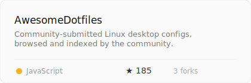
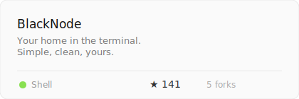
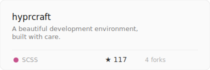

 

 
 

I build the layer between logic and people. Interfaces that behave exactly as expected, transitions that carry meaning, components that ship without footnotes.

My work lives at the intersection of engineering precision and design intent — not as separate disciplines, but as one continuous practice.

 

 

<table width="100%" cellpadding="0" cellspacing="0" border="0">
<tr>
<td width="50%" valign="top" align="left">

</td>
<td width="4%"></td>
<td width="46%" valign="top" align="left">

</td>
</tr>
<tr><td colspan="3"> </td></tr>
<tr>
<td width="50%" valign="top" align="left">

</td>
<td width="4%"></td>
<td width="46%" valign="top" align="left" style="vertical-align: middle; padding-top: 8px;">

**Currently building something worth showing.**

In the meantime — the work above speaks more clearly than any description I could write here.

</td>
</tr>
</table>

 

 

<table width="100%" cellpadding="0" cellspacing="0" border="0">
<tr>
<td width="25%" align="left">

**Reach for daily**

React &nbsp;·&nbsp; Next.js  
TypeScript &nbsp;·&nbsp; Tailwind  
Framer Motion &nbsp;·&nbsp; CSS

</td>
<td width="25%" align="left">

**Work on**

UI architecture  
Component systems  
Interaction design  
Performance budgets

</td>
<td width="25%" align="left">

**Care about**

Spacing as communication  
Motion with purpose  
APIs that don't leak  
Code that reads itself

</td>
<td width="25%" align="left">

**Open to**

Meaningful projects  
Hard interface problems  
Collaboration with people  
who have strong opinions

</td>
</tr>
</table>

 

 
 

